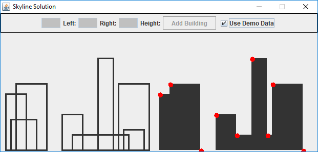

# skyline-problem

Uses the solution from the Algorithms - Java project: [SkylineProblem](https://github.com/TheAlgorithms/Java/tree/master/SkylineProblem).

The problem is explained here: [Divide and Conquer | Set 7 (The Skyline Problem)](https://www.geeksforgeeks.org/divide-and-conquer-set-7-the-skyline-problem/).

The following illustration presents our visualization. On the left are each of the buildings; where visible and non visible portions are shown. On the right is the silhouette or skyline, where the solution is plotted as a set of points.

