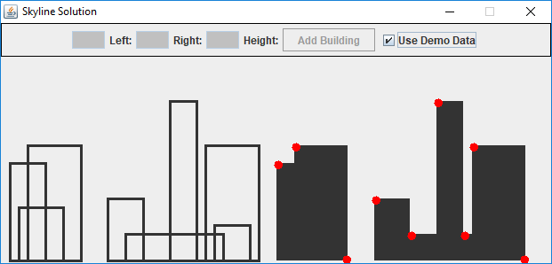

# skyline-problem

Uses the solution from here: [SkylineProblem](https://github.com/TheAlgorithms/Java/tree/master/SkylineProblem).

The problem is explained here: [Divide and Conquer | Set 7 (The Skyline Problem)](https://www.geeksforgeeks.org/divide-and-conquer-set-7-the-skyline-problem/).

